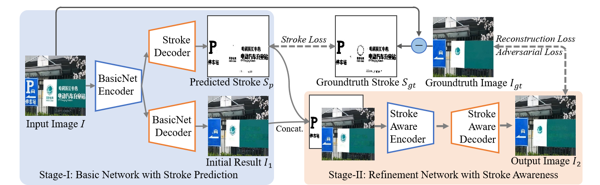

# Modeling Stroke Mask for End-to-End Text Erasing

[Paper](https://openaccess.thecvf.com/content/WACV2023/papers/Du_Modeling_Stroke_Mask_for_End-to-End_Text_Erasing_WACV_2023_paper.pdf) | [Project](http://10.5.8.102/dxc/saen.git)

### Introduction
In this paper, we present an end-to-end network that focuses on modeling text stroke masks that provide more accurate locations to compute erased images. The network consists of two stages, i.e., a basic network with stroke generation and a refinement network with stroke awareness. The basic network predicts the text stroke masks and initial erasing results simultaneously. The refinement network receives the masks as supervision to generate natural erased results.



## Getting Started
### Dependency
- This work was tested with PyTorch 1.4.0, CUDA 10.1, python 3.7 and Ubuntu 18.04. 
Clone this repo:
```bash
pip install -r requirements.txt
```
### Datasets
The datatset can be access at [SCUT-EnsText](https://github.com/HCIILAB/SCUT-EnsText) or synthetic dataset [SCUT-Syn](https://github.com/HCIILAB/Scene-Text-Removal) for training and testing.
- The dataset structure is as follows：

  ```text
    SCUT-EnsText
    ├── train_sets
    |    └── all_images
    |    └── all_labels
    |    └── all_gts
    ├── test_sets
         └── all_images
         └── all_labels
         └── all_gts
  ```

- To generate text stroke mask
```
python script/generate_stoke.py
```
- To generate trainlmdb and testlmdb dataset
```bash
python3 script/create_lmdb_dataset.py --inputPath SCUT-EnsText/train_sets/all_images --gtPath SCUT-EnsText/train_sets/all_labels --maskPath SCUT-EnsText/train_sets/stroke --outputPath SCUT-EnsText/trainlmdb
```
```bash
python3 script/create_lmdb_dataset.py --inputPath SCUT-EnsText/test_sets/all_images --gtPath SCUT-EnsText/test_sets/all_labels --maskPath SCUT-EnsText/test_sets/stroke --outputPath SCUT-EnsText/testlmdb
```

### Run demo with pretrained model
1. Download pretrained model from [here](https://drive.google.com/file/d/1LWHUIT58XQZd2FRlUc_VvWJj-n79YGoG/view?usp=share_link)
2. Run demo.py
```
python demo.py --pretrained "pretrained_model_path" --imgPath "test_img_path" --savedPath "saved_img_path"
```


### Training
Prepare the lmdb dataset and copy them under `./SCUT-EnsText` directory.

To train the model, you can change some parameter in `config/config.yaml`.
```bash
python train.py --config_path ./config/config.yml
```
### Testing
To generate the results of test datasets
```bash
python test.py --dataRoot SCUT-EnsText/testlmdb --batchSize 1 --pretrain "pretrained_model_path"
```
### Evaluation
To evaluate the results:
```bash
python evaluatuion.py --target_path "results path" --gt_path "ground_truth path"
```

## Citation
Please consider citing this work in your publications if it helps your research.
```
@inproceedings{du2023modeling,
  title={Modeling Stroke Mask for End-to-End Text Erasing},
  author={Du, Xiangcheng and Zhou, Zhao and Zheng, Yingbin and Ma, Tianlong and Wu, Xingjiao and Jin, Cheng},
  booktitle={Proceedings of the IEEE/CVF Winter Conference on Applications of Computer Vision},
  pages={6151--6159},
  year={2023}
}
```

## Acknowledgement
The code is benefit a lot from [EraseNet](https://github.com/lcy0604/EraseNet) and [EdgeConnect](https://github.com/knazeri/edge-connect). Thanks a lot for their excellent work.